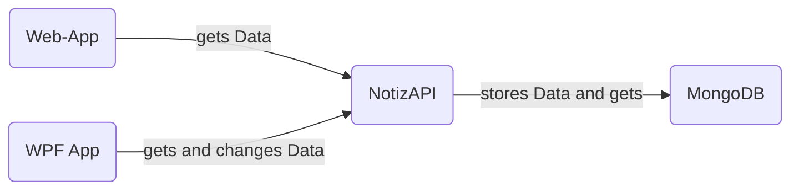
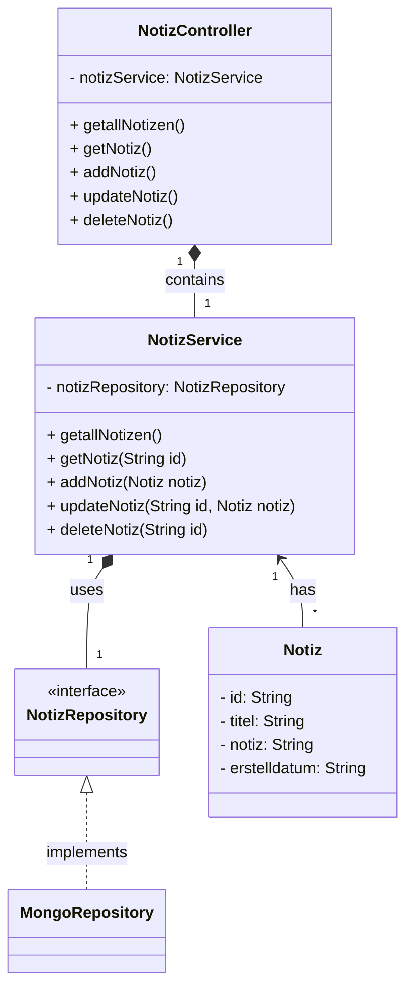

# NotizAPI
Meine Idee bestand darin, eine API zu entwickeln, die es Benutzern ermöglicht, Notizen auf einfache und effiziente Weise zu erstellen, zu löschen, zu laden und zu bearbeiten.
## Inhaltsverzeichnis
- [Softwaredesign](#softwaredesign)
- [Beschreibung der Software](#beschreibung-der-software)
- [API Beschreibung](#api-beschreibung)
- [Diagramm](#diagramm)
- [Diskussion](#diskussion)
- [Quellen](#quellen)

## Softwaredesign

Die beiden Clients beziehen ihre Daten über die API vom Server und haben die Möglichkeit, Anfragen an die API zu stellen. Der Server übernimmt die Kontrolle über alle eingehenden und ausgehenden Anfragen, die über die API erfolgen. Zusätzlich kommuniziert er mit der Datenbank, um sicherzustellen, dass die Daten dauerhaft gespeichert werden.
## Beschreibung der Software
### NotizAPI
Die Implementierung der API erfolgte unter Verwendung von Spring Boot. Für diese Zwecke wurden die folgenden Dependencies verwendet:
```
<dependencies>  
    <dependency>       
		<groupId>org.springframework.boot</groupId>  
        <artifactId>spring-boot-starter-data-mongodb</artifactId>  
    </dependency>    
    <dependency>        
	    <groupId>org.springframework.boot</groupId>  
        <artifactId>spring-boot-starter-web</artifactId>  
    </dependency>    
    <dependency>        
	    <groupId>org.springframework.boot</groupId>  
        <artifactId>spring-boot-starter-actuator</artifactId>  
    </dependency>    
    <dependency>        
	    <groupId>org.springframework.boot</groupId>  
        <artifactId>spring-boot-starter-test</artifactId>  
        <scope>test</scope>  
    </dependency>    
    <dependency>       
	    <groupId>jakarta.persistence</groupId>  
        <artifactId>jakarta.persistence-api</artifactId>  
        <version>2.2.3</version>  
    </dependency></dependencies>
```
Ebenso gibt es auch noch eine application.properties Datei, die die Serverkonfiguration beinhaltet. Diese sieht wie folgt aus: 
```
server.port =3020  
  
spring.data.mongodb.host=localhost  
spring.data.mongodb.port=27017  
spring.data.mongodb.database=POS  
  
management.endpoint.health.show-details=always  
management.endpoints.web.exposure.include=*
```
### WPF App
In der WPF-Applikation wurden sämtliche CRUD-Operationen (Create, Read, Update, Delete) umgesetzt, um eine vollständige Datenverwaltung zu ermöglichen. Dadurch ist es möglich, neue Daten anzulegen, bestehende Daten abzurufen, Daten zu aktualisieren und Daten zu löschen.
#### GET
Um alle Notizen von der API zu erhalten, wird eine GET-Request an die API gesendet. Im Anschluss werden die Daten im JSON-Format in eine Liste von Notiz Objekten umgewandelt und gespeichert.  Die foreach-Schleife geht jedes Objekt in der Liste durch und speichert diese dann in eine ListView.  
```
HttpClient client = new HttpClient();
HttpResponseMessage response = await client.GetAsync(baseApiURL);
              
response.EnsureSuccessStatusCode();
 
string responseBody = await response.Content.ReadAsStringAsync();
notizen = JsonConvert.DeserializeObject<List<Notiz>>(responseBody);
              
lstNotizen.Items.Clear();
foreach (Notiz item in notizen)
{
string shortTitle = item.Titel.Length > 20 ? item.Titel.Substring(0, 20) : item.Titel;
lstNotizen.Items.Add(shortTitle);
}

```
#### POST
In dieser Code-Anfrage wird eine HTTP POST-Anfrage mit einem HttpClient-Objekt an die API-URL gesendet. Die Daten für die Anfrage werden aus den Textfeldern "txtTitel" und "txtNotiz" abgerufen und in ein JSON-Format konvertiert. Anschließend wird der Inhalt der Anfrage mit dem JSON-Daten und dem entsprechenden Header erstellt und an die API gesendet.
```
HttpClient client = new HttpClient();
Notiz newData = new Notiz
 {
	Titel = txtTitel.Text,
	Notiz_ = txtNotiz.Text
  };

var jsonInput = JsonConvert.SerializeObject(newData);
var requestContent = new StringContent(jsonInput, Encoding.UTF8, "application/json");
var httpResponse = await client.PostAsync(baseApiURLpost, requestContent);
```
#### Update/PUT
In diesem Code-Abschnitt wird eine HTTP PUT-Anfrage mit einem HttpClient-Objekt an die API-URL gesendet, um eine vorhandene Notiz zu aktualisieren. Zuerst werden die aktualisierten Daten aus den Textfeldern "txtTitel" und "txtNotiz" in das ausgewählte Notizobjekt übertragen. Anschließend wird das Notizobjekt in ein JSON-Format konvertiert.

Ein HttpClient-Objekt wird erstellt und verwendet, um die PUT-Anfrage an die spezifische API-URL mit dem aktualisierten Notizobjekt als Inhalt zu senden. 
```
selectedNotiz.Titel = txtTitel.Text;
selectedNotiz.Notiz_ = txtNotiz.Text;

string json = JsonConvert.SerializeObject(selectedNotiz);
HttpClient client = new HttpClient();
HttpResponseMessage response = await client.PutAsync($"{baseApiURLpost}/{selectedNotiz.id}", new StringContent(json, Encoding.UTF8, "application/json"));

response.EnsureSuccessStatusCode();

txtTitel.Clear();
txtNotiz.Clear();

MessageBox.Show("Notiz erfolgreich geändert.");

previousWindow.Load_Notizen();
```
#### DELETE
Der folgende Codeabschnitt demonstriert das Senden einer HTTP DELETE-Anfrage an die API. Er stellt sicher, dass die ausgewählte Notiz anhand des selektierten Elements in der ListBox "lstNotizen" ermittelt wird. Sollte keine Notiz ausgewählt sein, wird eine Benachrichtigung angezeigt und der Vorgang abgebrochen. Andernfalls wird die ID der ausgewählten Notiz extrahiert.
```
Notiz selectedNotiz = notizen.Find(n => n.Titel.StartsWith(lstNotizen.SelectedItem.ToString()));

if (selectedNotiz == null)
{
	MessageBox.Show("Bitte wählen Sie eine Notiz aus, die gelöscht werden soll.");
	return;
}
string notizId = selectedNotiz.Id;

HttpClient client = new HttpClient();
HttpResponseMessage response = await client.DeleteAsync($"{baseApiURLpost}/{notizId}");
              
response.EnsureSuccessStatusCode();

notizen.RemoveAll(n => n.Id == notizId);
```
### Web-App
Auf dieser Website werden die Notizen in einem ansprechenderen Format präsentiert als in der WPF-App. Dabei wurden erneut die CRUD-Operationen implementiert, was bedeutet, dass Benutzer Notizen hinzufügen, löschen, bearbeiten und laden können.
#### GET
Diese Code-Funktion führt eine HTTP GET-Anfrage an die API-URL.

Die Funktion verwendet die Fetch-API, um die Anfrage zu senden. Nachdem die Antwort erhalten wurde, wird sie in das JSON-Format konvertiert.

Anschließend wird die Liste der Notizen im HTML-Dokument geleert und für jede Notiz in den abgerufenen Daten wird ein Listenelement erstellt.

Am Ende werden die erstellten Listenelemente zur Notizenliste hinzugefügt.

```
function fetchNotes() {

  fetch("http://localhost:3020/notizen")

    .then(response => response.json())

    .then(data => {

      notesList.innerHTML = "";

      data.forEach(note => {

        const listItem = document.createElement("li");

        listItem.setAttribute("data-id", note.id);

        listItem.innerHTML = `

          <h3 class="note-title">${note.titel}</h3>

          <p class="note-notiz">${note.notiz}</p>

          <span class="date">${note.erstelldatum}</span>

          <div class="icon-bottom-right"><i class="uil uil-minus"></i></div>

        `;

        notesList.appendChild(listItem);

      });

    })

    .catch(error => console.log(error));
}
```
#### POST
Die folgende Funktion "addNoteToAPI" stellt eine HTTP GET-Anfrage an eine API-URL, um eine neue Notiz hinzuzufügen. Die Funktion akzeptiert zwei Parameter, "title" und "description", die den Titel und die Beschreibung der neuen Notiz enthalten.

Eine neue Notiz wird mit den übergebenen Werten sowie dem aktuellen Erstellungsdatum erstellt. Anschließend wird die Fetch-API verwendet, um eine POST-Anfrage an die angegebene API-URL zu senden. Der Anfrage werden der Header "Content-Type" mit dem Wert "application/json" und der Body, der die neue Notiz im JSON-Format enthält, hinzugefügt.
```
function addNoteToAPI(title, description) {

  const newNote = {

    titel: title,

    notiz: description,

    erstelldatum: new Date().toLocaleString()

  };

  fetch("http://localhost:3020/notiz", {

    method: "POST",

    headers: {

      "Content-Type": "application/json"

    },

    body: JSON.stringify(newNote)

  })

    .then(response => {

      if (response.ok) {

        fetchNotes();

      } else {

        throw new Error("Failed to add note to API.");

      }

    })

    .catch(error => console.log(error));

}
```
#### Update/PUT
Zunächst wird ein aktualisiertes Notizobjekt erstellt, das die Notiz-ID, den Titel und die Beschreibung enthält.

Anschließend wird ein fetch-Aufruf verwendet, um die PUT-Anfrage an die API-URL mit der Notiz-ID zu senden. Der Inhaltstyp des Anfrage-Headers wird auf "application/json" gesetzt, und das aktualisierte Notizobjekt wird als JSON im Anfrage-Body übermittelt.

Wenn die Antwort erfolgreich ist, wird die JSON-Datenantwort abgerufen. Die entsprechenden HTML-Elemente der aktualisierten Notiz in der Benutzeroberfläche werden mit den erhaltenen Daten aktualisiert. 
```
function updateNoteInAPI(noteId, title, description) {

  const updatedNote = {

    id: noteId,

    titel: title,

    notiz: description

  };

  fetch(`http://localhost:3020/notiz/${noteId}`, {

    method: "PUT",

    headers: {

      "Content-Type": "application/json"

    },

    body: JSON.stringify(updatedNote)

  })

    .then(response => {

      if (response.ok) {

        return response.json();

      } else {

        throw new Error("Failed to update note in API.");
      }

    })

    .then(data => {

      const listItem = document.querySelector(`li[data-id="${noteId}"]`);

      listItem.querySelector("h3").textContent = data.titel;

      listItem.querySelector("p").textContent = data.notiz;

      listItem.querySelector("span").textContent = data.erstelldatum;

      clearNoteInputs();

      popupBox2.classList.remove("show");
    })
    .catch(error => console.log(error));
}
```
#### DELETE
Zunächst wird die Funktion mit der Note-ID aufgerufen. Ein Fetch-Aufruf wird an die entsprechende API-URL mit der DELETE-Methode gesendet.

Anschließend wird die Antwort überprüft. Wenn die Antwort erfolgreich ist, wird die Funktion "fetchNotes()" aufgerufen, um die aktualisierten Notizen abzurufen. Andernfalls wird eine Fehlermeldung ausgegeben, falls das Löschen der Notiz von der API fehlschlägt.
```
function deleteNoteFromAPI(noteId) {

  fetch(`http://localhost:3020/notiz/${noteId}`, {

    method: "DELETE"

  })

    .then(response => {

      if (response.ok) {

        fetchNotes();

      } else {

        throw new Error("Failed to delete note from API.");
      }

    })

    .catch(error => console.log(error));

}
```
## API Beschreibung
<details>
 <summary><code>GET</code>  <code>/notizen</code>&emsp;Gets all notes</summary>

##### Parameters

> no Parameters

##### RequestBody
>None

##### Responses

> http code | response|
> -|-
> `200`        | `Successful Operation`
> `400`        | `{"code":"400","message":"Bad Request"}` 
> `404`        | `Not found`
</details>

<details>
 <summary><code>GET</code>  <code>/notizen/{id}</code>&emsp;Gets an note with id</summary>

##### Path-Parameters

> | name | type |
> | - | - |
> | id | string |

##### RequestBody
>None

##### Responses

> http code | response|
> -|-
> `200`        | `Successful Operation`
> `400`        | `{"code":"400","message":"Bad Request"}` 
> `404`        | `Not found`
</details>

<details>
<summary><code>POST</code> <code>/notiz</code>&emsp;Adds an Note</summary>

##### Parameters

> no Parameters
	
##### RequestBody (required)
```yaml
{
"titel":  "title",
"notiz":  "note"
}
```

##### Responses

> http code | response|
> -|-
> `200`        | `Configuration created successfully`
> `400`        | `{"code":"400","message":"Bad Request"}` 
</details>

<details>
 <summary><code>PUT</code> <code>/notiz/{id}</code>&emsp;Updates a note with id</summary>

##### Path-Parameters

> | name | type |
> | - | - |
> | id | string |

##### RequestBody (required)
```yaml
{
"id": "646d0454571e7569fdea7dd4"
"titel":  "title",
"notiz":  "note"
}
```

##### Responses

> http code | response|
> -|-
> `200`        | `Configuration created successfully`
> `400`        | `{"code":"400","message":"Bad Request"}` 
> `404`        | `Not found` 
</details>

<details>
 <summary><code>DELETE</code> <code>/notiz/{id}</code>&emsp;Deletes a note with id</summary>

##### Path-Parameters

> | name | type |
> | - | - |
> | id | string |

##### RequestBody
> None
> 

##### Responses

> http code | response|
> -|-
> `200`        | `Success`
> `400`        | `{"code":"400","message":"Bad Request"}` 
> `404`        | `Not Found`
</details>

## Diagramm

## Diskussion
Das finale Produkt dieses Projekts ist eine Spring Boot-Anwendung, die über eine API Anfragen entgegennehmen kann. Diese Anwendung ist mit einer MongoDB-Datenbank verbunden, in der die Notizen gespeichert werden. In der WPF-Applikation besteht die Möglichkeit, Notizen hinzuzufügen, zu bearbeiten, zu löschen und anzuzeigen. Auf der Website können dieselben Aktionen durchgeführt werden, jedoch werden die Daten hier in einer ansprechenderen und übersichtlicheren Darstellung präsentiert.

Insgesamt verlief das Projekt größtenteils relativ gut. Die Entwicklung der WPF-Applikation gestaltete sich anfangs etwas herausfordernd, doch mit ausreichend Recherche wurde es viel besser. Bei der Website hingegen gab es anfangs einige Probleme, insbesondere mit der Funktionalität meiner Update-Methode. Glücklicherweise gelang es mir jedoch nach einiger Zeit, den Fehler zu beheben. Die Implementierung der API verlief im Vergleich dazu relativ problemlos, da ich bereits einige Erfahrungen hierbei hatte.

In der Zukunft könnte eventuell noch eine Searchbar in der Web-App hinzugefügt werden. Ebenso könnte das Design verschönert werden.

## Quellenverzeichnis
* https://learn.microsoft.com/en-us/dotnet/desktop/wpf/?view=netdesktop-7.0
* https://stackoverflow.com/
* https://peter.baumgartner.name/wp-content/uploads/2022/12/Markdown-Cheat-Sheet.pdf
* https://mermaid.js.org/
* https://gomakethings.com/getting-html-with-fetch-in-vanilla-js/
